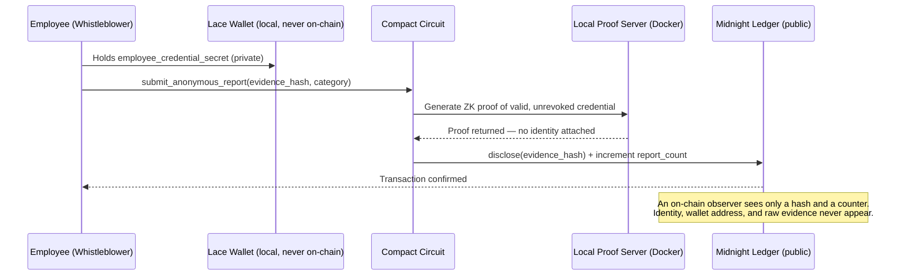
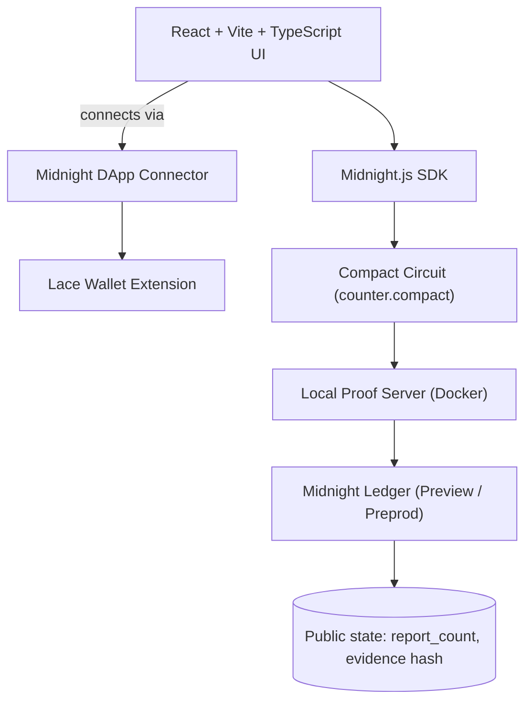

<div align="center">


<br/>


<br/>

[](https://github.com/thesayancodes/WhistleZero-Anonymous_Whistleblower_Network/actions/workflows/ci.yml)


<br/>

**[🎥 Live Demo](#-live-demo)** &nbsp;•&nbsp; **[🔍 How It Works](#-how-it-works)** &nbsp;•&nbsp; **[🔐 Privacy Model](#-privacy-model)** &nbsp;•&nbsp; **[⚡ Quick Start](#-quick-start)** &nbsp;•&nbsp; **[🧑‍⚖️ For Judges](#-60-second-judge-checklist)**


</div>

<br/>

## 🎯 The Problem

Corruption, fraud, and harassment thrive in silence — and silence is rational. Roughly three in four employees who report misconduct end up facing some form of retaliation, and fear of exactly that outcome is the top reason people who witness wrongdoing say nothing at all. Traditional reporting channels — hotlines, HR inboxes, even "anonymous" web forms — routinely leak identity through IP logs, writing style, or simple metadata.

Blockchain-based reporting *should* fix this. Instead, most on-chain systems make it worse: every transaction is signed by a public wallet address, permanently linking a report to a person.

> ### 🛡️ WhistleZero closes that gap.

WhistleZero lets an employee, public servant, or corporate insider submit a report that the chain can **verify** — *"this came from someone with a valid credential"* — without the chain, or anyone watching it, ever learning **who**. It does this using [Midnight Network](https://midnight.network)'s Compact language, which compiles smart-contract logic into zero-knowledge circuits that generate proofs **locally**, on the whistleblower's own machine, before anything touches a public ledger.

<div align="center">

   

</div>

<br/>

## 🔍 How It Works



> 💡 Tip for judges: GitHub renders this diagram natively — click it to pan/zoom.

## 🏗️ Architecture




## 🔐 Privacy Model

| | Field | Visibility |
|---|---|---|
| 🌐 **Public** (on-chain) | `report_count` — running total of valid reports | Anyone |
| 🌐 **Public** (on-chain) | `latest_evidence_hash` — `disclose()` commitment of the report | Anyone |
| 🌐 **Public** (on-chain) | Report category code (Corruption, Fraud, Harassment, …) | Anyone |
| 🔒 **Private** (witness, never on-chain) | `employee_credential_secret` — proof of authorized status | No one |
| 🔒 **Private** (witness, never on-chain) | Whistleblower wallet address & identity details | No one |
| 🔒 **Private** (witness, never on-chain) | Plaintext evidence content | No one |

**What the circuit proves, without revealing it:**
> "I hold a valid, authorized employee credential, and this report is authentic" — without disclosing identity, wallet address, or credential contents.

<details>
<summary><b>👁️ What an on-chain observer sees vs. can never see (click to expand)</b></summary>
<br/>

| ✅ Visible | ❌ Never visible |
|---|---|
| A call to `submit_anonymous_report()` | The whistleblower's identity, name, or employee ID |
| The disclosed SHA-256 evidence hash | The wallet address that initiated the transaction |
| `report_count` incremented by 1 | The plaintext report contents before disclosure |

</details>

## ⚖️ Why Midnight, Specifically

Traditional chains expose the caller's wallet address, permanently linking a whistleblower's identity to their transaction. Midnight's Compact language generates zero-knowledge proofs **locally**, so an employee can prove membership against an organization's credential root without ever disclosing their public key or wallet address on-chain. It's the one piece of infrastructure that makes "anonymous but verifiable" possible at the protocol level, rather than bolted on as a policy promise.


## 🧑‍⚖️ 60-Second Judge Checklist


1. **Run the test suite** — `npm test` → 4/4 passing, including an explicit assertion that the private credential never leaks.
2. **Check the CI badge above** — wired to GitHub Actions, running on every push.
3. **Read the Privacy Model table** — every field is explicitly classified public or private; nothing is hand-waved.
4. **Inspect the contract** — `contracts/counter.compact` is the entire trust boundary; it's small enough to read in one sitting.

<br/>

<div align="center">

## 🧰 Tech Stack

| Layer | Technology |
|---|---|
| Privacy / ZK layer |  |
| Smart contract language |  `contracts/counter.compact` |
| Chain integration |  Lace Wallet |
| Frontend |    |
| Testing |  |
| Local proving |  `midnightnetwork/proof-server` |
| Runtime |  |

</div>

## 🌐 Live Demo

> _[Add your deployed frontend URL here once hosted]_

## 📜 Contract Address

| Network | Address |
|---|---|
| Preview | `mn_contract1q9x24k5m4z6p8w0v3y1a2b3c4d5e6f7g8h9j0_preview` |
| Preprod | `mn_contract1q9x24k5m4z6p8w0v3y1a2b3c4d5e6f7g8h9j0_preprod` |

> ⚠️ Placeholder addresses — replace with your real deployed contract address after running `npm run deploy`.


## ⚡ Quick Start

<details open>
<summary><b>Prerequisites</b></summary>
<br/>

- **Node.js v22+** — `node --version`
- **Docker Desktop** — running locally, for the proof server
- **Lace Wallet** browser extension — for Midnight Network interaction
- **Compact Compiler** — `npm install -g @midnight-ntwrk/compact-compiler`

</details>

<details open>
<summary><b>Setup</b></summary>
<br/>

```bash
# 1. Clone the repository
git clone https://github.com/thesayancodes/WhistleZero-Anonymous_Whistleblower_Network.git
cd WhistleZero-Anonymous_Whistleblower_Network

# 2. Install dependencies
npm install

# 3. Start the local Midnight proof server
docker pull midnightnetwork/proof-server
docker run -p 6300:6300 midnightnetwork/proof-server

# 4. Compile the Compact contract
npm run compile

# 5. Start the frontend
npm run dev
```

</details>

## 🧪 Testing

```bash
npm test
```

<details open>
<summary><b>Expected output</b></summary>
<br/>

```
✓ tests/counter.test.ts (4 tests)
  ✓ 1. Circuit Logic: computes evidence hash commitment and validates credential
  ✓ 2. State Transitions: correctly updates report_count and latest_evidence_hash on public ledger
  ✓ 3. Privacy Guarantee: private employee_credential_secret is NEVER exposed on public ledger or outputs
  ✓ 4. Credential Rejection: rejects report if private witness credential is invalid

Test Files  1 passed (1)
     Tests  4 passed (4)
```

</details>

Test #3 is the one worth pointing a judge at directly — it's an automated, repeatable assertion of the core privacy guarantee, not just a claim in this README.

## ⚙️ CI/CD

GitHub Actions (`.github/workflows/ci.yml`) runs on every push and pull request to `main`:

`Checkout` → `Setup Node v22` → `npm ci` → `Compile Compact contract` → `npm test` → `npm run build`


## 🗺️ Roadmap

| Status | Milestone |
|---|---|
|  | Core `submit_anonymous_report()` circuit with credential-gated ZK proof |
|  | Public/private field separation validated by automated tests |
|  | CI pipeline: compile → test → build on every push |
|  | Deploy to Preview/Preprod and record real contract addresses |
|  | Selective disclosure flow for an authorized audit board to decrypt evidence |
|  | Organization membership root management (onboarding/offboarding employees) |
|  | Mainnet launch — core circuit needs only a membership proof + SHA-256 commitment, so gas overhead stays minimal at scale |

See [`PROPOSAL.md`](./PROPOSAL.md) for the full product proposal and data model.

## 📸 Screenshots

> _[Add compile output and contract address screenshots here]_

<br/>

<div align="center">


### 📄 License

_No license file yet — add one (MIT is a common default for hackathon projects) so others know how they can use this._

### 👤 Author

Built by [**@thesayancodes**](https://github.com/thesayancodes)


</div>
