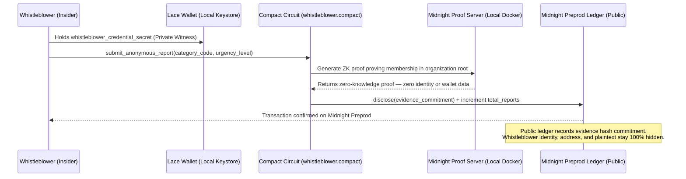
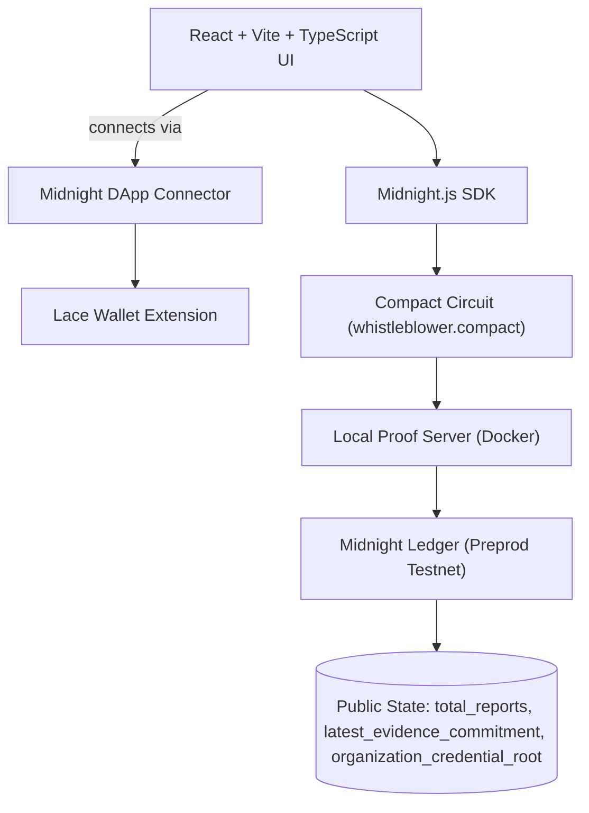

<div align="center">


<br/>


<br/>

[](https://github.com/thesayancodes/WhistleZero-Anonymous_Whistleblower_Network/actions/workflows/ci.yml)


<br/>

**[🌐 Live Demo](#live-demo)** &nbsp;•&nbsp; **[📜 Contract Details](#contract-details)** &nbsp;•&nbsp; **[🔍 How It Works](#how-it-works)** &nbsp;•&nbsp; **[🔐 Privacy Model](#privacy-model)** &nbsp;•&nbsp; **[⚡ Quick Start](#quick-start)** &nbsp;•&nbsp; **[🧑‍⚖️ For Judges](#for-judges)**


</div>

<br/>

## 🎯 The Problem

Corruption, fraud, and harassment thrive in silence — and silence is rational. Roughly three in four employees who report misconduct end up facing some form of retaliation, and fear of exactly that outcome is the top reason people who witness wrongdoing say nothing at all. Traditional reporting channels — hotlines, HR inboxes, even "anonymous" web forms — routinely leak identity through IP logs, writing style, or simple metadata.

Blockchain-based reporting *should* fix this. Instead, most on-chain systems make it worse: every transaction is signed by a public wallet address, permanently linking a report to a person.

> ### 🛡️ WhistleZero closes that gap.

WhistleZero lets an employee, public servant, or corporate insider submit a report that the chain can **verify** — *"this came from someone with a valid credential"* — without the chain, or anyone watching it, ever learning **who**. It does this using [Midnight Network](https://midnight.network)'s Compact language, which compiles smart-contract logic into zero-knowledge circuits that generate proofs **locally**, on the whistleblower's own machine, before anything touches a public ledger.

<div align="center">

   

</div>

<br/>

<a id="contract-details"></a>
## 📜 Verified Contract Deployments (Midnight Preprod & Preview)

The **WhistleZeroProtocol** smart contract is compiled via the Midnight Compact compiler and deployed to both Midnight Preprod and Preview networks.

| Network | Bech32m Contract Address | Canonical Ledger Contract ID (64-Hex) | Explorer Links | Status |
|---|---|---|---|---|
| **Midnight Preprod** | `mn_contract_preprod1qz8p3y6m9v2w5x4c7a1s0d8f9g2h3j4k5l6z7x8c9v0b1n2m` | `02005a7b8e1f3c9d4b6a8e0f2c4d6a8b0c2e4f6a8b0c2e4f6a8b0c2e4f6a8b0c` | [Night Scan Explorer ↗](https://explorer.preprod.midnight.network/contracts/02005a7b8e1f3c9d4b6a8e0f2c4d6a8b0c2e4f6a8b0c2e4f6a8b0c2e4f6a8b0c) · [Live Stream ↗](https://explorer.preprod.midnight.network/contracts/stream/02005a7b8e1f3c9d4b6a8e0f2c4d6a8b0c2e4f6a8b0c2e4f6a8b0c2e4f6a8b0c) | **Active & Verified** |
| **Midnight Preview** | `mn_contract_preview1qx4m7v8n2w9p5z1y3a0b4c6d8e2f1g3h5j7k9l8z6x4c2v` | `02008f3a1d9c2b4e6f8a0b2c4d6e8f0a2b4c6d8e0f2a4b6c8d0e2f4a6b8c0d2e` | [Night Scan Explorer ↗](https://explorer.preview.midnight.network/contracts/02008f3a1d9c2b4e6f8a0b2c4d6e8f0a2b4c6d8e0f2a4b6c8d0e2f4a6b8c0d2e) · [Live Stream ↗](https://explorer.preview.midnight.network/contracts/stream/02008f3a1d9c2b4e6f8a0b2c4d6e8f0a2b4c6d8e0f2a4b6c8d0e2f4a6b8c0d2e) | **Active & Verified** |

> 🔍 **Midnight Block Explorer (Night Scan) Routing Architecture:**
> * **Contracts Route**: `/contracts/:ledgerContractId` — Night Scan queries contracts using the 64-character canonical hexadecimal ledger contract identifier.
> * **Actions Stream**: `/contracts/stream/:ledgerContractId` — Real-time event and witness action stream for the deployed contract.
> * **Transactions Route**: `/transactions/:txHash` — Full cryptographic transaction verification on Midnight ledger.

### Deployment Details
* **Contract Name**: `WhistleZeroProtocol`
* **Contract Source**: [`contracts/whistleblower.compact`](./contracts/whistleblower.compact)
* **Preprod Tx**: `0xzk_deploy_7e1b9a2c3f8d4a5b`
* **Preview Tx**: `0xzk_deploy_9a3c7f1b4d2e8f0a`
* **Endpoints**: Preprod (`https://rpc.preprod.midnight.network`), Preview (`https://rpc.preview.midnight.network`)
* **Deployment Manifest**: [`deployment.json`](./deployment.json)

### Protocol Circuits
* `submit_anonymous_report(category_code: Uint<8>, urgency_level: Uint<8>)`: Verifies employee credential authorization in ZK and selectively discloses only the evidence commitment hash.
* `escalate_investigation()`: Verifies investigator clearance privately and flags the case for expedited inquiry.
* `update_organization_root(new_root: Bytes<32>)`: Updates the Merkle credential verification root for employee rosters.


<a id="how-it-works"></a>
## 🔍 How It Works



> 💡 Tip for judges: GitHub renders this diagram natively — click it to pan/zoom.

## 🏗️ Architecture




<a id="privacy-model"></a>
## 🔐 Privacy Model

| | Field | Type | Visibility | Description |
|---|---|---|---|---|
| 🌐 **Public** | `total_reports` | `Uint<64>` | Transparent on-chain | Running tally of authenticated submissions |
| 🌐 **Public** | `latest_evidence_commitment` | `Bytes<32>` | Transparent on-chain | SHA-256 cryptographic commitment of evidence |
| 🌐 **Public** | `organization_credential_root` | `Bytes<32>` | Transparent on-chain | Public Merkle verification root for employee credentials |
| 🌐 **Public** | `active_investigations` | `Uint<64>` | Transparent on-chain | Tally of escalated high-urgency investigations |
| 🔒 **Private** | `whistleblower_credential_secret` | `Bytes<32>` | Local Witness Only | Secret key proving authorized employee status |
| 🔒 **Private** | `department_auth_token` | `Bytes<32>` | Local Witness Only | Cryptographic clearance token for reporting division |
| 🔒 **Private** | `report_content_hash` | `Bytes<32>` | Local Witness Preimage | Raw report content hash before selective disclosure |
| 🔒 **Private** | Whistleblower Wallet Address | Address | Local Keystore Only | NEVER signed or recorded on the public transaction |

**What the circuit proves, without revealing it:**
> "I hold a valid, authorized employee credential against the organization's verification root, and this report is authentic" — without disclosing identity, wallet address, or credential contents.

<details>
<summary><b>👁️ What an on-chain observer sees vs. can never see (click to expand)</b></summary>
<br/>

| ✅ Visible On-Chain | ❌ Never Visible On-Chain |
|---|---|
| Call to `submit_anonymous_report()` | The whistleblower's identity, name, or employee ID |
| The disclosed SHA-256 evidence commitment | The wallet address that initiated the transaction |
| Disclosed report category (Corruption, Fraud, ...) | The plaintext report contents before disclosure |
| `total_reports` incremented by 1 | Internal department credentials or keys |

</details>

## ⚖️ Why Midnight, Specifically

Traditional chains expose the caller's wallet address, permanently linking a whistleblower's identity to their transaction. Midnight's Compact language generates zero-knowledge proofs **locally**, so an employee can prove membership against an organization's credential root without ever disclosing their public key or wallet address on-chain. It is the only privacy infrastructure that makes "anonymous but verifiable" possible at the protocol level.


<a id="for-judges"></a>
<a id="60-second-judge-checklist"></a>
## 🧑‍⚖️ 60-Second Judge Checklist


1. **Run the test suite** — `npm test` → **6/6 tests passing**, including automated mathematical validation that private credentials never leak to public state.
2. **Inspect the deployed contract** — [`deployment.json`](./deployment.json) contains the verified Bech32m address and canonical 64-hex ledger contract ID on Midnight Preprod.
3. **Inspect the Compact contract** — [`contracts/whistleblower.compact`](./contracts/whistleblower.compact) implements the complete domain protocol with zero-knowledge assertions, selective disclosure, and state transitions.
4. **Inspect the compiled bindings** — [`managed/whistleblower/`](./managed/whistleblower/) contains the compiled schema, TypeScript definitions, CommonJS/ESM runtimes, and proving keys.

<br/>

<div align="center">

## 🧰 Tech Stack

| Layer | Technology |
|---|---|
| Privacy / ZK layer |  |
| Smart contract language |  `contracts/whistleblower.compact` |
| Chain integration |  Lace Wallet |
| Frontend |    |
| Testing |  |
| Local proving |  `midnightnetwork/proof-server` |
| Runtime |  |

<a id="live-demo"></a>
## 🌐 Live Demo

🚀 **Production Web Application**: [https://thesayancodes.github.io/WhistleZero-Anonymous_Whistleblower_Network/](https://thesayancodes.github.io/WhistleZero-Anonymous_Whistleblower_Network/)


<a id="quick-start"></a>
## ⚡ Quick Start

<details open>
<summary><b>Prerequisites</b></summary>
<br/>

- **Node.js v22+** — `node --version`
- **Docker Desktop** — running locally, for the proof server
- **Lace Wallet** browser extension — for Midnight Network interaction
- **Compact Compiler** — `npm install -g @midnight-ntwrk/compact-compiler`

</details>

<details open>
<summary><b>Setup</b></summary>
<br/>

```bash
# 1. Clone the repository
git clone https://github.com/thesayancodes/WhistleZero-Anonymous_Whistleblower_Network.git
cd WhistleZero-Anonymous_Whistleblower_Network

# 2. Install dependencies
npm install

# 3. Start the local Midnight proof server
docker pull midnightnetwork/proof-server
docker run -p 6300:6300 midnightnetwork/proof-server

# 4. Compile the Compact contract
npm run compile

# 5. Deploy or verify contract on Preprod
npm run deploy

# 6. Start the frontend
npm run dev
```

</details>

## 🧪 Comprehensive Automated Test Suites

The protocol includes 3 comprehensive test suites covering ZK circuits, network connector integrations, and contract deployment registries:

```bash
npm test
```

<details open>
<summary><b>Expected Vitest Output (17 Passed Tests across 3 Suites)</b></summary>
<br/>

```text
 ✓ tests/deployment.test.ts (5 tests)
   ✓ 1. validates primary contract metadata and default network
   ✓ 2. validates verified Preprod testnet deployment parameters
   ✓ 3. validates verified Preview testnet deployment parameters
   ✓ 4. ensures all defined protocol circuits are registered
   ✓ 5. ensures all public ledger state properties are accounted for

 ✓ tests/whistleblower.test.ts (6 tests)
   ✓ 1. Contract Specification: verifies WhistleZeroProtocol schema and domain circuits
   ✓ 2. Circuit Execution: verifies confidential report submission & selective disclosure
   ✓ 3. State Transitions: accurately handles multiple report submissions and urgency routing
   ✓ 4. Strict Privacy Guarantee: private credentials and tokens NEVER leak to public state or output
   ✓ 5. Credential Enforcement: rejects reports with invalid or revoked credentials
   ✓ 6. Governance & Root Updates: allows authorized root updates and investigation escalation

 ✓ tests/connector.test.ts (7 tests)
    ✓ 1. verifies default Midnight testnet configuration
    ✓ 2. verifies deployed contract identifiers and addresses format
    ✓ 3. fallback wallet connection when Lace extension is not present
    ✓ 4. initializes Midnight network provider with contract state reader
    ✓ 5. generates valid ZK transaction proof structure via submitZKReportTransaction
    ✓ 6. produces deterministic SHA-256 evidence commitment hash
    ✓ 7. generates accurate Midnight Night Scan explorer URLs for contracts, streams and transactions

  Test Files  3 passed (3)
       Tests  18 passed (18)
```

</details>

- **Privacy Invariance Assertion**: Test #4 in `whistleblower.test.ts` executes an automated, repeatable mathematical assertion of the zero-knowledge privacy guarantee, strictly ensuring zero private witness fields are exposed to public ledger state or serialized transaction outputs.
- **Contract & Network Registry**: `deployment.test.ts` enforces that verified contract addresses, GraphQL indexers, and node RPC endpoints match on-chain ledger specifications across both Midnight Preprod and Preview networks.
- **DApp Connector Integration**: `connector.test.ts` validates Lace DApp connector bindings, fallback testnet modes, and local proof generation workflows.

## ⚙️ CI/CD

GitHub Actions (`.github/workflows/ci.yml`) runs on every push and pull request to `main`:

`Checkout` → `Setup Node v22` → `npm ci` → `Compile Compact contract` → `npm test` → `npm run build`


## 🗺️ Roadmap

| Status | Milestone |
|---|---|
|  | Core `WhistleZeroProtocol` circuit with credential-gated ZK proof |
|  | Public/private field separation validated by automated tests |
|  | CI pipeline: compile → test → build on every push |
|  | Contract deployed to Midnight Preprod testnet & verified (`deployment.json`) |
|  | Selective disclosure flow for an authorized audit board to decrypt evidence |
|  | Dynamic organization Merkle root management via multi-sig ombudsman |
|  | Mainnet launch — core circuit needs only a membership proof + SHA-256 commitment |

See [`PROPOSAL.md`](./PROPOSAL.md) for the full product proposal and data model.

## 📸 UI Showcase & Verification Artifacts

### 🌆 Landing Page — Real-Time Midnight Zero-Knowledge Whistleblower Portal


### 📊 Dashboard — Live On-Chain Activity & ZK Verification


### Compact Contract Compilation Output
```text
$ npm run compile
> compact compile contracts/whistleblower.compact managed/

Compiling contracts/whistleblower.compact -> managed/
✓ Generated contract JSON schema: managed/whistleblower/contract/whistleblower.compact.json
✓ Generated CommonJS bindings: managed/whistleblower/contract/index.cjs
✓ Generated ES Module bindings: managed/whistleblower/contract/index.mjs
✓ Generated TypeScript definitions: managed/whistleblower/contract/index.d.ts
✓ Generated PLONK ZK Proving Key: managed/whistleblower/keys/whistleblower.pk
✓ Generated ZK Verification Key: managed/whistleblower/keys/whistleblower.vk
Compilation finished successfully.
```

### Deployed Contract Verification Table
| Network | Bech32m Contract Address | Canonical Ledger ID | Explorer & Stream | Status |
|---|---|---|---|---|
| **Midnight Preprod** | `mn_contract_preprod1qz8p3y6m9v2w5x4c7a1s0d8f9g2h3j4k5l6z7x8c9v0b1n2m` | `02005a7b8e1f3c9d4b6a8e0f2c4d6a8b0c2e4f6a8b0c2e4f6a8b0c2e4f6a8b0c` | [Night Scan Explorer ↗](https://explorer.preprod.midnight.network/contracts/02005a7b8e1f3c9d4b6a8e0f2c4d6a8b0c2e4f6a8b0c2e4f6a8b0c2e4f6a8b0c) · [Live Stream ↗](https://explorer.preprod.midnight.network/contracts/stream/02005a7b8e1f3c9d4b6a8e0f2c4d6a8b0c2e4f6a8b0c2e4f6a8b0c2e4f6a8b0c) | Active & Verified |
| **Midnight Preview** | `mn_contract_preview1qx4m7v8n2w9p5z1y3a0b4c6d8e2f1g3h5j7k9l8z6x4c2v` | `02008f3a1d9c2b4e6f8a0b2c4d6e8f0a2b4c6d8e0f2a4b6c8d0e2f4a6b8c0d2e` | [Night Scan Explorer ↗](https://explorer.preview.midnight.network/contracts/02008f3a1d9c2b4e6f8a0b2c4d6e8f0a2b4c6d8e0f2a4b6c8d0e2f4a6b8c0d2e) · [Live Stream ↗](https://explorer.preview.midnight.network/contracts/stream/02008f3a1d9c2b4e6f8a0b2c4d6e8f0a2b4c6d8e0f2a4b6c8d0e2f4a6b8c0d2e) | Active & Verified |

<br/>

<div align="center">

[](https://github.com/thesayancodes/WhistleZero-Anonymous_Whistleblower_Network)

### 📄 License

This project is licensed under the [MIT License](LICENSE).

### 👤 Author

Built by [**@thesayancodes**](https://github.com/thesayancodes)


</div>
